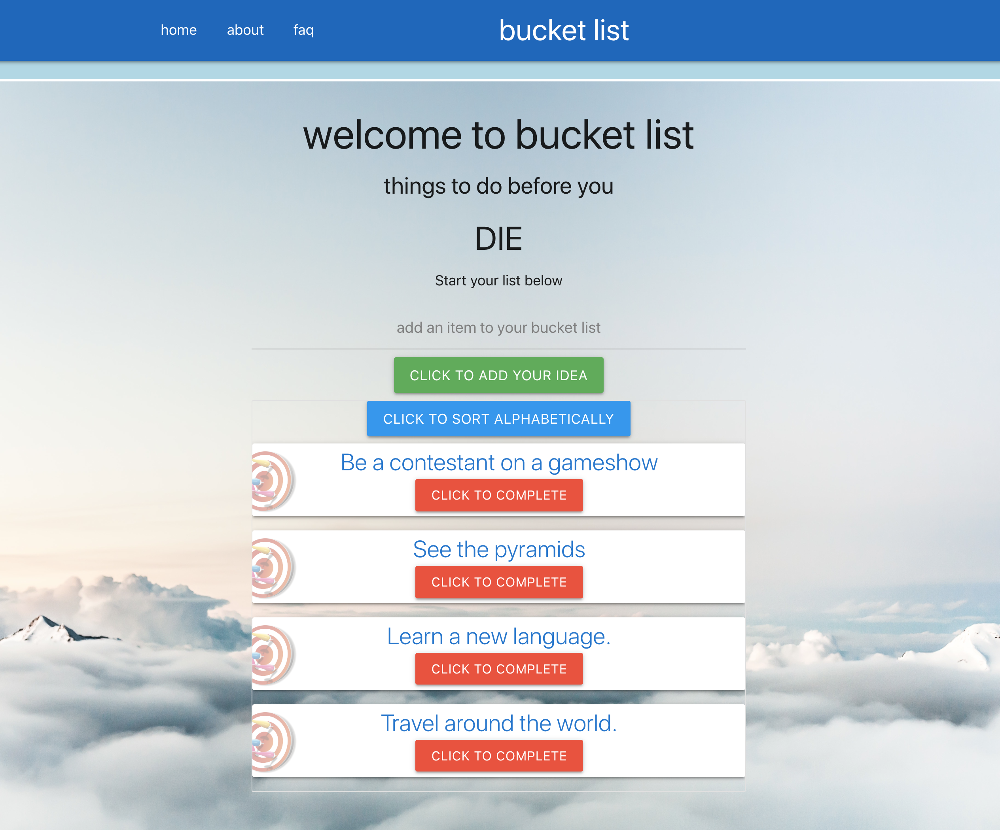
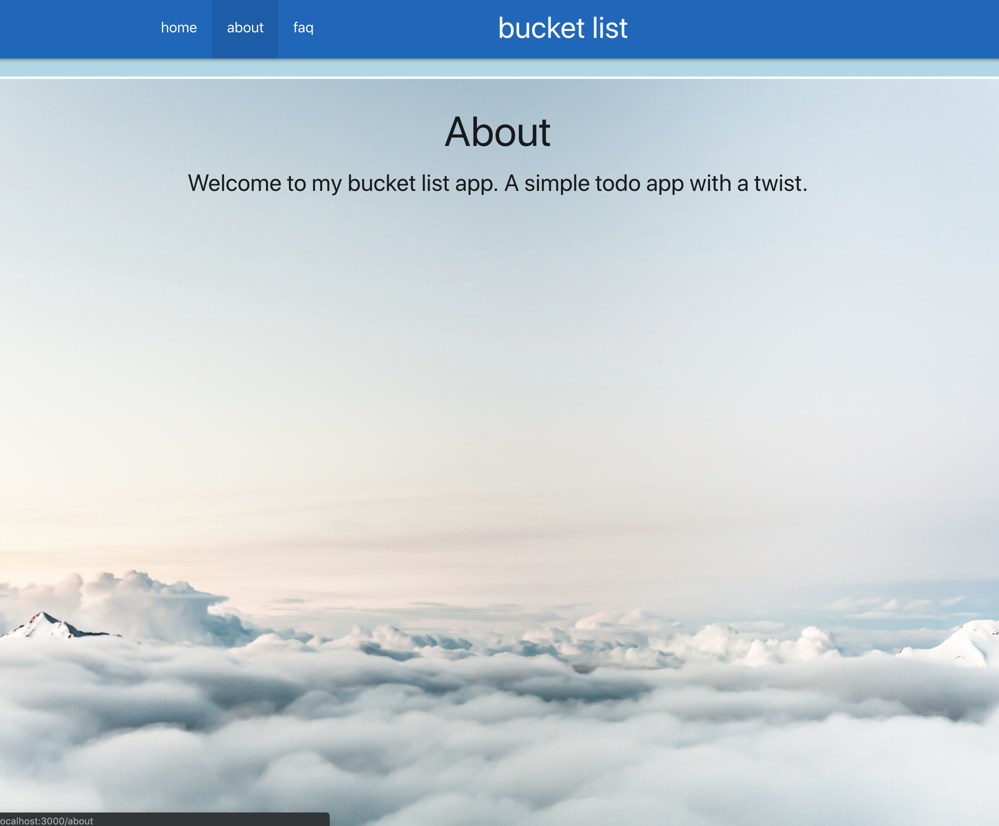

# BUCKET LIST

Welcome to Bucket List, a simple todo app with a twist.

  

## Video Demo

## Specs
- React / Redux-Thunk frontend
- Rails API backend to manage data persistence: https://github.com/SilverBright/bucketlist-app-api
- react-router with RESTful routing
- materializecss for minimal stylization

## Installation

Clone or download `git@github.com:SilverBright/bucketlist-app-client.git`.

Switch to the project directory and run:   
### `bundle install`

Have your Rails API running on port 3001 (see [here](https://github.com/SilverBright/bucketlist-app-api/blob/master/README.md) for instructions), then start the client application:
### `npm start`

Navigate to [http://localhost:3000](http://localhost:3000) to view it in the browser.  

## Instructions

Add a new bucket list item by typing in the field, and clicking submit.   
Each new entry will be visible at the top of the list.   
You can delete your entry by selecting 'click to complete'.   
An optional button is included to sort your list alphabetically.  
A user also can navigate to the FAQ page, About page, or back to the Home page.

## License

The app is available as open source under the terms of the [MIT License](https://github.com/SilverBright/bucketlist-app-client/blob/master/LICENSE).